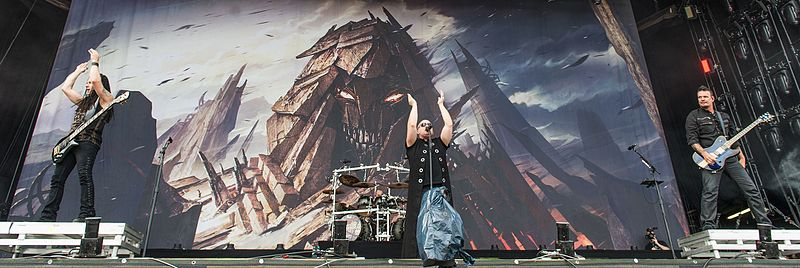

:orphan:

Disturbed
=========================

An American heavy metal band from Chicago formed in 1994. The band has had a few change of members during their career but
they have been able to continue up to making seven studio albums. They were on a haitus until the album Immortalized was
released and have since been releasing more albums and activities.

Disturbed has had a long history bouncing between melodies of heavy metal, hard rock, nu metal, and alternative metal.
This happens because the melody they produce for all their albums are going in varying directions, however Disturbed
has touched on many topics during its long career.

Their current mascot is named "The Guy" who was just someone drawn with a large grin. It has since been the only
mascot used for various albums after The Sickness with different renditions and scenes. "The Guy" is featured in animation
and music videos in a number of Disturbed's publicly published recordings.

	
.. _image source: https://commons.wikimedia.org/wiki/File:2016_RiP_Disturbed_-_by_2eight_-_DSC7890.jpg

*Their Album list:*

* Brawl
* The Sickness
* Believe
* Ten Thousand Fists
* Indestructible
* Asylum
* The Lost Children
* Immortalized
* Evolution

**Top 5 songs:**

====================== ====
Song        	       Rank
====================== ====
Down With The Sickness 1
Stricken	           2
Indestructible	       3
Inside the Fire	       4
The Night	           5
====================== ====