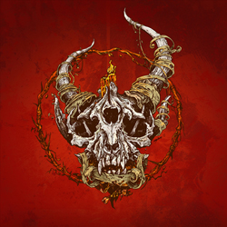

:orphan:

Demon Hunter
=========================

An american band, starting in 2000 by two brothers, is considered a Christian band from Seattle Washington but only one of
the brothers remain since the other had to return to a family life. They have sold half a million copies and have done
Alternative metal in one point of their history.

Demon Hunter was initially a project that had their faces hidden from most of the media until they revealed themselves on
their first tour which featured metal and metalcore youngbloods. From there, tours have been consistent until 2009, where
members had to leave due to scheduling or other stable careers.

The Band is still going strong with their eight album, Outlive, and are on their way to their 9th album in 2019 called War
and Peace.

This band has been used by the US military after Metallica had requested the US Military to stop using their music for
interrogations. Demon Hunter had allegedly offered their music for this practice and was accepted. However, after Bin Laden
had been found and killed Demon Hunter had disputed the use of their music. They approved the use of their icon but they
did not volunteer their music.

	
.. _image source: https://en.wikipedia.org/wiki/File:Demon-Hunter-True-Defiance-Artwork.jpg

*Their Album list:*

* Demon Hunter
* Summer of Darkness
* The Triptych
* Storm the Gates of Hell
* The World Is a Thorn
* True Defiance
* Extremist
* Outlive

**Top 5 songs:**

================== ====
Song        	   Rank
================== ====
Fading Away        1
Deteriorate        2
The Last One Alive 3
What I'm Not	   4
Carry Me Down	   5
================== ====