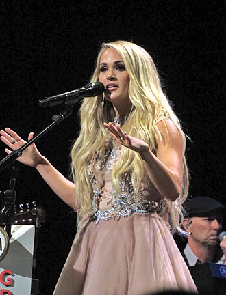

Carrie Underwood
================

About
-----

Carrie Underwood is an American country singer, songwriter, and actress.
She is known for winning the fourth season of American Idol which resulted
in her music career taking off.

Her debut single was, "Inside Your Heaven," which was released in 2005.
Today, her top song is "Before He Cheats" which is not a part of her current
top album. 

Top Songs
~~~~~~~~~
* Before He Cheats
* Love Wins
* The Champion
* Church Bells
* Cry Pretty

==================== =================
 **Top Albums**      **Release Date**
==================== =================
*Cry Pretty*              2018
*Storyteller*             2015
*Blown Away*              2012
*Play On*                 2009
*Carnival Ride*           2007
==================== =================

Click `here <https://en.wikipedia.org/wiki/Carrie_Underwood>`_ for more 
information and where this information and image was found.
