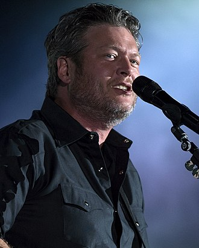

Blake Shelton
=============

About
-----

Blake Shelton is an American country singer and songwriter.
He has multiple well-known songs and albums that are known by people
around the world and all over the United States. Today, his top song is
*Turnin' Me On* which is a part of his top album *Texoma Shore*. 

Blake got his start in 2001 and made his debut with his song *Austin*,
and is still currently writing and producing more songs. You can find him
on tours often, and you can listen to his music on country radio stations, Pandora, Spotify, and more. 

He is also a part of the television show called *The Voice* where
he is known for being a part of the judges. As a judge he helps pick a young artist to become the winner of the show and subsequently start their own music career. 

You can find more information about Blake Shelton from the website Wikipedia which is linked below or from his official website featuring his bio and more information about tours and other aspects of his life.

Top Songs
~~~~~~~~~
* Turnin'Me On 
* I Lived It 
* A Guy With a Girl
* Sangria  
* Boys 'Round Here 

Discography
~~~~~~~~~~~
============================= =================
**Top Albums**                 **Release Date**
============================= =================
*Texoma Shore*                    2017
*If I'm Honest*                   2016
*Bringing Back the Sunshine*      2014
*Red River Blue*                  2011
*Based on a True Story*           2013
============================= =================

Click `here <https://en.wikipedia.org/wiki/Blake_Shelton>`_ for more 
information and where this information and picture was found.
