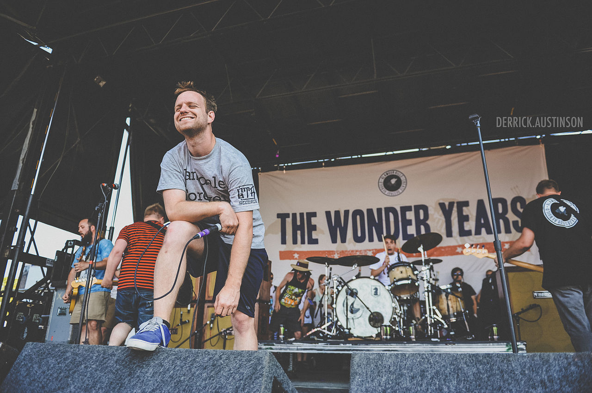

The Wonder Years
================

.. _image source: https://www.flickr.com/photos/deraustinson/9180556856/

About
-----

Hailing from south Philadelphia, The Wonder Years consists of Dan Campbell, 
Matt Brasch, Casey Cavaliere, Mike Kennedy, Josh Martin, and Nick Steinborn. 
Since their formation in 2005 the band has released numerous works including 
six studio albums and two eps. Sometimes described as “easycore”, the band’s 
sound utilizes a blend of major key instrumentals, catchy choruses, and melodic 
hardcore-esque grit. The Wonder Years has been a major name in the pop-punk 
scene since their formation, and has been cited as having a big hand in the 
rise of the easycore genre. Much of The Wonder Years’ records can be described 
as concept albums dealing with topics such as singer Dan Campbell’s struggles 
mental health and depression through growing up and graduating college, doubts 
about career paths and life choices, and the death of a friend. Since their 
early years, The Wonder Years have ventured away from their strict pop-punk 
sound, maturing with their audience. Later releases, including 2015 record 
*No Closer to Heaven* and 2018 record *Sister Cities* exemplify this.

Top Songs
---------

* **Passing Through A Screen Door**
* **Came Out Swinging**
* **Sister Cities**
* **I Don't Like Who I Was Then**
* **Melrose Diner**

Discography
-----------

================================================= =================================================
Albums                                                               Release
================================================= =================================================
*Get Stoked On It*                                                     2007
*The Upsides*                                                          2010
*Suburbia I've Given You All and Now I'm Nothing*                      2011
*The Greatest Generation*                                              2013
*No Closer to Heaven*                                                  2015
*Sister Cities*                                                        2018
================================================= =================================================
